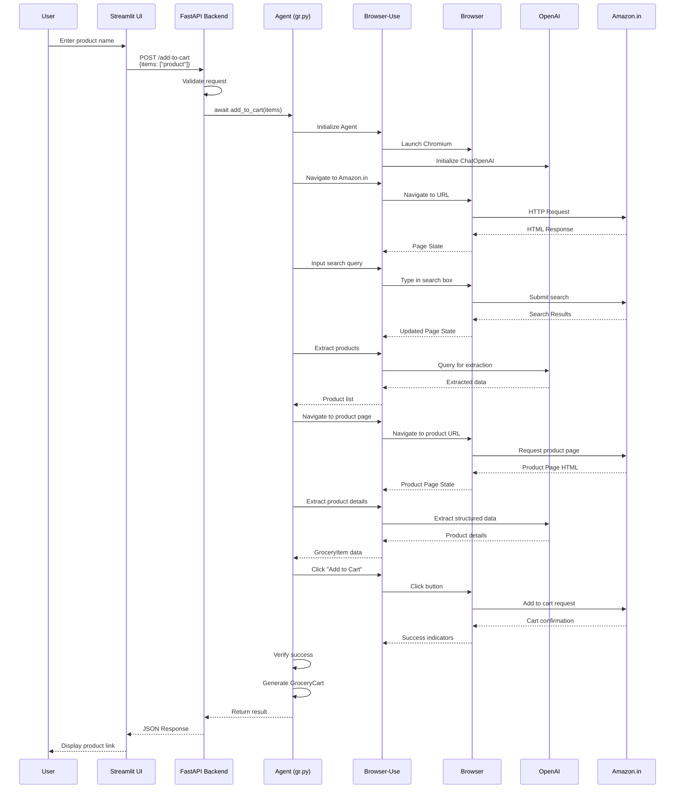
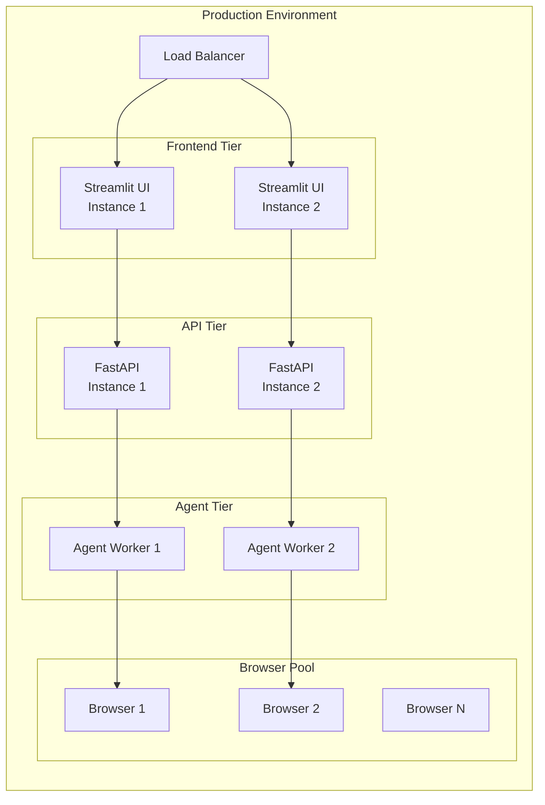

# Amazon Cart Automation - System Architecture

## High-Level Architecture Diagram

```mermaid
graph TB
    subgraph "Client Layer"
        User[👤 User]
        UI[🖥️ Streamlit UI<br/>ui/ui.py]
    end

    subgraph "API Gateway Layer"
        API[🚀 FastAPI Backend<br/>backend/api.py<br/>Port: 8000]
        CORS[CORS Middleware]
    end

    subgraph "Business Logic Layer"
        Agent[🤖 Browser Agent<br/>gr.py]
        TaskEngine[Task Engine]
    end

    subgraph "Browser Automation Layer"
        BrowserUse[🌐 Browser-Use Library]
        Browser[🌍 Chromium Browser]
        LLM[🧠 OpenAI GPT-4o-mini]
    end

    subgraph "External Services"
        Amazon[🛒 Amazon.in]
    end

    subgraph "Data Models"
        Request[📝 AddToCartRequest<br/>items: List[str]]
        Response[📤 AddToCartResponse<br/>success, message, cart]
        GroceryCart[🛒 GroceryCart<br/>items: List[GroceryItem]]
        GroceryItem[📦 GroceryItem<br/>name, price, brand, size, url]
    end

    User -->|1. Enter Product Name| UI
    UI -->|2. POST /add-to-cart<br/>JSON: items| API
    API -->|3. Validate Request| Request
    API -->|4. Call add_to_cart| Agent
    Agent -->|5. Create Task Prompt| TaskEngine
    Agent -->|6. Initialize| BrowserUse
    BrowserUse -->|7. Launch| Browser
    BrowserUse -->|8. Query| LLM
    BrowserUse -->|9. Navigate & Interact| Amazon
    Amazon -->|10. HTML/DOM| Browser
    Browser -->|11. Page State| BrowserUse
    BrowserUse -->|12. Actions & Results| Agent
    Agent -->|13. Structured Output| GroceryCart
    GroceryCart -->|14. Response| Response
    Response -->|15. JSON Response| API
    API -->|16. Display Results| UI
    UI -->|17. Show Product Link| User

    API -.->|CORS Headers| CORS
    CORS -.->|Allow Streamlit| UI

    style User fill:#e1f5ff
    style UI fill:#4CAF50,color:#fff
    style API fill:#009688,color:#fff
    style Agent fill:#FF9800,color:#fff
    style BrowserUse fill:#2196F3,color:#fff
    style Browser fill:#9C27B0,color:#fff
    style LLM fill:#F44336,color:#fff
    style Amazon fill:#FFC107,color:#000
    style GroceryCart fill:#795548,color:#fff
    style GroceryItem fill:#607D8B,color:#fff
```

## Component Details

### 1. Streamlit UI (`ui/ui.py`)
**Purpose**: User interface for interacting with the system

**Key Features**:
- Product search input
- Add to cart button
- API health check
- Progress indicators
- Results display (product links only)

**Technologies**:
- Streamlit framework
- HTTP requests (requests library)
- Real-time status updates

**Endpoints Used**:
- `GET /health` - Health check
- `POST /add-to-cart` - Add products to cart

---

### 2. FastAPI Backend (`backend/api.py`)
**Purpose**: REST API gateway and request handler

**Key Features**:
- CORS middleware for Streamlit integration
- Request validation using Pydantic models
- Error handling and response formatting
- Async request processing

**Endpoints**:
- `GET /` - Root endpoint
- `GET /health` - Health check
- `POST /add-to-cart` - Main endpoint for cart operations

**Request/Response Models**:
```python
AddToCartRequest:
  - items: List[str]

AddToCartResponse:
  - success: bool
  - message: str
  - cart: Optional[GroceryCart]
  - error: Optional[str]
```

**Technologies**:
- FastAPI framework
- Uvicorn ASGI server
- Pydantic for data validation

---

### 3. Browser Agent (`gr.py`)
**Purpose**: Core automation logic using browser-use library

**Key Features**:
- Amazon.in product search automation
- Product extraction and filtering (non-sponsored products)
- Cart addition with success verification
- Structured output generation

**Workflow**:
1. Navigate to Amazon.in
2. Search for product using input action
3. Extract first 10 products (identify sponsored vs non-sponsored)
4. Select first non-sponsored matching product
5. Navigate to product detail page
6. Extract product details (name, price, brand, size, URL)
7. Click "Add to Cart" button
8. Verify success indicators
9. Return structured output

**Technologies**:
- browser-use library
- OpenAI GPT-4o-mini (via ChatOpenAI)
- Chromium browser automation
- Pydantic models for structured output

**Data Models**:
```python
GroceryItem:
  - name: str
  - price: float
  - brand: Optional[str]
  - size: Optional[str]
  - url: str

GroceryCart:
  - items: List[GroceryItem]
```

---

## Data Flow Sequence



## Technology Stack

### Frontend
- **Streamlit**: Python-based web framework for UI
- **HTTP Client**: Python `requests` library

### Backend
- **FastAPI**: Modern Python web framework
- **Uvicorn**: ASGI server
- **Pydantic**: Data validation and serialization

### Automation
- **browser-use**: Browser automation library
- **Chromium**: Headless browser engine
- **OpenAI GPT-4o-mini**: LLM for decision making
- **CDP (Chrome DevTools Protocol)**: Browser control

### Data Models
- **Pydantic BaseModel**: Type-safe data structures

## Security & Configuration

### CORS Configuration
```python
CORS Middleware:
  - allow_origins: ["*"]  # Configure for production
  - allow_credentials: True
  - allow_methods: ["*"]
  - allow_headers: ["*"]
```

### Environment Variables
- `OPENAI_API_KEY`: Required for LLM access
- API URL: Configurable in UI (default: `http://localhost:8000`)

## Error Handling

### UI Layer
- Connection errors
- Timeout handling (5 minutes)
- API error responses
- Empty response handling

### API Layer
- Request validation errors
- Agent execution errors
- Structured output missing
- Exception catching and formatting

### Agent Layer
- Browser navigation failures
- Element not found errors
- Page load timeouts
- Success verification failures
- Retry logic for failed actions

## Performance Considerations

- **Timeout Settings**:
  - API request: 300 seconds (5 minutes)
  - Agent step: 120 seconds (2 minutes)
  - Max steps: 50

- **Browser Configuration**:
  - Headless mode: False (visible browser)
  - Window size: Default
  - Page load wait times: 2-3 seconds

## Deployment Architecture



## Future Enhancements

1. **Streaming Updates**: Real-time progress updates to UI
2. **Browser Pool**: Manage multiple browser instances
3. **Queue System**: Handle concurrent requests
4. **Caching**: Cache product search results
5. **Authentication**: User authentication and session management
6. **Monitoring**: Logging and metrics collection
7. **Rate Limiting**: Prevent abuse and API throttling
